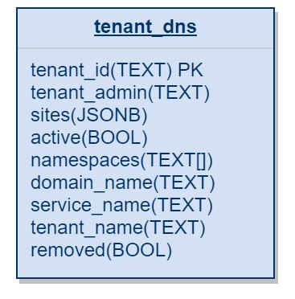

[](https://github.com/Netcracker/qubership-core-site-management/actions/workflows/go-build.yml)
[](https://sonarcloud.io/summary/overall?id=Netcracker_qubership-core-site-management)
[](https://sonarcloud.io/summary/overall?id=Netcracker_qubership-core-site-management)
[](https://sonarcloud.io/summary/overall?id=Netcracker_qubership-core-site-management)
[](https://sonarcloud.io/summary/overall?id=Netcracker_qubership-core-site-management)
[](https://sonarcloud.io/summary/overall?id=Netcracker_qubership-core-site-management)

This documentation describes Site Management REST API. It contains: 

* [Overview](#overview)
* [Environment Variables](#environment-variables )
* [PUBLIC REST API](#public-rest-api)
   * [Validate tenant scheme: Unauthorized, Public API](#validate-tenant-scheme-unauthorized-public-api)
   * [Get list of services available via public routes: Authorized mode request, Public API](#get-list-of-services-available-via-public-routes-authorized-mode-request-public-api)
   * [Get list of routes for specific tenant: Authorized mode request, Public API](#get-list-of-routes-presented-in-openshift-authorized-mode-request-public-api)
   * [Get identity-provider route for specific tenant: Authorized mode request, Public API](#get-identity-provider-route-for-specific-tenant-authorized-mode-request-public-api)
   * [Get list of routes for specified tenants (bulk): Authorized mode request, Public API](#get-list-of-routes-for-specified-tenants-bulk-authorized-mode-request-public-api)
   * [Get list of routes presented in cloud project: Authorized mode request, Public API](#get-list-of-routes-presented-in-openshift-authorized-mode-request-public-api)
   * [Put new routes scheme for tenant: Authorized mode request, Public API](#put-new-routes-scheme-for-tenant-authorized-mode-request-public-api)
   * [Get all routes schemes: Unauthorized, Public API](#get-all-routes-schemes-unauthorized-public-api)
   * [Get routes scheme for specific tenant: Unauthorized, Public API](#get-routes-scheme-for-specific-tenant-unauthorized-public-api)
   * [Get site by URL for tenant: Unauthorized, Public API](#get-site-by-url-for-tenant-unauthorized-public-api)
   * [Delete routes scheme for tenant: Authorized mode request, Public API](#delete-routes-scheme-for-tenant-authorized-mode-request-public-api)
   * [Activate tenant: Authorized mode request, Public API](#activate-tenant-authorized-mode-request-public-api)
   * [Deactivate tenant: Authorized mode request, Public API](#deactivate-tenant-authorized-mode-request-public-api)
   * [Search tenant by service host: Unauthorized, Public API](#search-tenant-by-service-host-unauthorized-public-api)
* [Database Schema](#database-schema)

# Overview
Site Management is a microservice that processes cloud project external routes.

# Environment Variables 
| Environment Variable         | Description                                                  | Default Value                                                         | 
|------------------------------|--------------------------------------------------------------|-----------------------------------------------------------------------|
| SERVICE_URL_DEFAULT_PROTO    | Route protocol (deprecated, CLOUD_PROTOCOL automatically used instead)                                               | https                                                                 | 
| CONFIG_SERVER                | Address of config-server                                     | `http://config-server:8080` (or `https://config-server:8443`)         | 
| IDENTITY_PROVIDER_URL        | Address of identity-provider                                 | `http://identity-provider:8080` (or `https://identity-provider:8443`) | 
| PAAS_MEDIATION_ADDRESS       | Address of paas-mediation                                    | `http://paas-mediation:8080` (or `https://paas-mediation:8443`)       |
| TENANT_DEFAULT_DOMAIN_ZONE   | Default domain zone for tenant                               | None                                                                  | 
| TRACING_ENABLED              | Is tracing enabled                                           | false                                                                 |
| TRACING_HOST                 | Tracing server host                                          | None                                                                  |
| TRACING_SAMPLER_RATELIMITING | The rate for requests sampling (number of traces per second) | 10                                                                    |


# PUBLIC REST API
All endpoints are registered on public gateway.

| Info          | Endpoint      | Since | Till      |
| ------------- | ------------- | ----- |-----------|
| Validate tenant scheme  | `POST /api/<version>/site-management/validate` | v1 |           |
| Put new routes scheme for tenant | `PUT /api/<version>/site-management/routes` | v1 |           |
| Get the site by URL for tenant | `GET /api/<version>/site-management/routes/{tenantExternalId}/site  + H: url` | v1 |           |
| Get routes scheme for specific tenant | `GET /api/<version>/site-management/routes/{tenantId}` | v1 |           |
| Get list of services available via public routes | `GET /api/<version>/site-management/public-services` | v1 |           |
| Get list of routes presented in cloud project | `GET /api/<version>/site-management/openshift-routes` | v1 |           |
| Get list of routes for specified tenants (bulk) | `POST /api/<version>/site-management/annotated-routes-bulk` | v1 |           |
| Get list of routes for specific tenant (mixed tenant and general routes) | `GET /api/<version>/site-management/annotated-routes?tenantId={tenantId}` | v1 |           |
| Get all routes schemes | `GET /api/<version>/site-management/routes` | v1 |           |
| Delete routes scheme for tenant | `DELETE /api/<version>/site-management/routes/{tenantId}` | v1 |           |
| Deactivate tenant. Force site management to delete routes from cloud project | `POST /api/<version>/site-management/routes/{tenantId}/deactivate` | v1 |           |
| Activate tenant. Force site management to create routes in cloud project | `POST /api/<version>/site-management/routes/{tenantId}/activate` | v1 |           |
| Search tenant by service host | `GET /api/<version>/site-management/search?host={host}` | v1 |           |

## Validate tenant scheme: Unauthorized, Public API

### Request:

Validate given schema against the following rules:
* validate URL syntax
* unique across tenants 

### Request URL:

```
POST <public-gateway-url>/api/<version>/site-management/validate
```

### Request body:
```
{
  "tenantId": "sm",
  "sites": {
    "default": {
      "site-management": [
        "sm.openshift.sdntest.qubership.org"
      ],
      "tenant-manager": [
        ""
      ],
      "service-portal": [
        "autotest-e56d8b75-spec-cloud-catalog-ci.svt.openshift.sdntest.qubership.org"
      ]
    },
    "central": {
      "tenant-manager": [
        "sm.openshift.sdntest.qubership.org"
      ],
      "site-management": [
        "sm-central.openshift.sdntest.qubership.org"
      ]
    }
  }
}
```
### Parameters: 
None

### Response:

| HttpStatus | HttpStatus Code | Response body | Comments |
|---|---|---|---|
| HttpStatus.OK | **200** | List of validated services | Validation was processed successfully |
| HttpStatus.BAD_REQUEST | **400** | "Invalid request payload" | Site management cannot marshal request body to route scheme |
| HttpStatus.INTERNAL_SERVER_ERROR | **500** | Error description | Internal error has occurred |

### Response body sample:
```
{
    "central": {
        "site-management": {
            "valid": true,
            "reason": ""
        },
        "tenant-manager": {
            "valid": false,
            "reason": "Matches with another service site-management in current tenant"
        }
    },
    "default": {
        "service-portal": {
            "valid": false,
            "reason": "Matches with URL for service tenant-autotest-e56d8b75 in tenant 0398877d-9f8c-4128-ad45-cdf33b1b9a77"
        },
        "site-management": {
            "valid": false,
            "reason": "Matches with another service tenant-manager in current tenant"
        },
        "tenant-manager": {
            "valid": false,
            "reason": "Not a valid URL"
        }
    }
}
```
## Get list of services available via public routes: Authorized mode request, Public API

### Request:
Use GET request to get list of public services

### Request URL:
```
http://<public-gateway-url>/api/<version>/site-management/public-services
```
### Parameters:
| Name  | Purpose | Default Value | Mandatory |
| ------------- | ------------- | ----- | ---- |
| namespaces | Comma-separated list of namespaces | Current namespace | No |

### Response:
| HttpStatus | HttpStatus Code | Response body | Comments |
|---|---|---|---|
| HttpStatus.OK | **200** | List of services | List of services was built without problems |
| HttpStatus.INTERNAL_SERVER_ERROR | **500** | Error description | Internal error has occurred |

### Response body sample:
```
[
    {
        "metadata": {
            "name": "csr-frontend",
            "namespace": "cloud-catalog-ci",
            "annotations": {
                "qubership.cloud/tenant.service.alias.prefix": "csr-frontend",
                "qubership.cloud/tenant.service.show.description": "Service for sales to manage and research customers",
                "qubership.cloud/tenant.service.show.name": "Customer Sales Representative"
            }
        },
        "spec": {
            "selector": {
                "name": "csr-frontend"
            },
            "clusterIP": "172.16.10.8",
            "Type": "ClusterIP",
            "ports": [
                {
                    "name": "web"
                    "protocol": "TCP",
                    "port": 8080,
                    "targetPort": 8080
                }
            ]
        }
    },
    {
        "metadata": {
            "name": "customer-self-service-fe",
            "namespace": "cloud-catalog-ci",
            "annotations": {
                "qubership.cloud/tenant.service.alias.prefix": "customer-self-service",
                "qubership.cloud/tenant.service.show.description": "Service for customers to manage users, products, licenses",
                "qubership.cloud/tenant.service.show.name": "Customer Self Service"
            }
        },
        "spec": {
            "selector": {
                "name": "csr-frontend"
            },
            "clusterIP": "172.16.10.8",
            "Type": "ClusterIP",
            "ports": [
                {
                    "name": "web"
                    "protocol": "TCP",
                    "port": 8080,
                    "targetPort": 8080
                }
            ]
        }
    }
]
```
## Get list of routes for specific tenant: Authorized mode request, Public API

### Request:
Use GET request to get list of public services

### Request URL:
```
http://<public-gateway-url>/api/<version>/site-management/annotated-routes?tenantId={tenantId}
```
### Parameters:
| Name  | Purpose | Default Value | Mandatory |
| ------------- | ------------- | ----- | ---- |
| tenantId | Tenant for which list of routes will be built | | Yes |
| protocol | Protocol used in URLs for routes | http | No |
| ignoreMissing | Ignore if tenantId is missing in database | false | No |
| site | Site for tenant specific routes | default | No |

### Response:
| HttpStatus | HttpStatus Code | Response body | Comments |
|---|---|---|---|
| HttpStatus.OK | **200** | List of routes | List of routes was built without problems |
| HttpStatus.NOT_FOUND | **404** | Error description | Tenant is not active or was not found in database in case ignoreMissing parameter is false |
| HttpStatus.INTERNAL_SERVER_ERROR | **500** | Error description | Internal error has occurred |

### Response body sample:
```
[
    {
        "id": "domain-resolver-frontend",
        "name": "Domain resolver frontend",
        "url": "http://domain-resolver-frontend-cloud-catalog-ci.svt.openshift.sdntest.qubership.org/",
        "description": "domain-resolver-frontend"
    },
    {
        "id": "interaction-designer-ui",
        "name": "Interaction designer",
        "url": "http://interaction-designer-ui-cloud-catalog-ci.svt.openshift.sdntest.qubership.org/",
        "description": "Interaction designer"
    },
    {
        "id": "product-management-fe",
        "name": "Products Catalogue",
        "url": "http://product-management-4-cloud-catalog-ci.svt.openshift.sdntest.qubership.org/#/product-offerings",
        "description": "Service to manage your products"
    }
]
```

## Get identity-provider route for specific tenant: Authorized mode request, Public API

### Request:
Use GET request to get identity-provider route

### Request URL:
```
http://<public-gateway-url>/api/<version>/site-management/identity-provider-route?tenantId={tenantId}
```
### Parameters:
| Name  | Purpose | Default Value | Mandatory |
| ------------- | ------------- | ----- | ---- |
| tenantId | Tenant for which list of routes will be built | | Yes |
| protocol | Protocol used in URLs for routes | http | No |
| ignoreMissing | Ignore if tenantId is missing in database | false | No |
| site | Site for tenant specific routes | default | No |

### Response:
| HttpStatus | HttpStatus Code | Response body | Comments |
|---|---|---|---|
| HttpStatus.OK | **200** | List of routes | List of routes was built without problems |
| HttpStatus.NOT_FOUND | **404** | Error description | Tenant is not active or was not found in database in case ignoreMissing parameter is false |
| HttpStatus.INTERNAL_SERVER_ERROR | **500** | Error description | Internal error has occurred |

### Response body sample:
```
[
    {
        "id": "identity-provider",
        "name": "Identity Provider",
        "url": "https://public-gateway-core-rnd-cpl-baseline.some-cloud.qubership.org/",
        "description": "URL to access Identity Provider API"
    }
]
```

## Get list of routes for specified tenants (bulk): Authorized mode request, Public API

### Request:
Use POST request to get list of public services for tenants

### Request URL:
```
http://<public-gateway-url>/api/<version>/site-management/annotated-routes-bulk
```

### Request body:
```
[
    {
        "tenantId": "215c4b3d-72f3-4a52-8682-7352738a6809",
        "protocol": "https",
        "site": "default",
        "ignoreMissing": true
    },
    {
        "tenantId": "d21f968f-ee78-43d7-b6c5-8beb245e2508",
        "protocol": "https",
        "site": "default",
        "ignoreMissing": true
    }
]
```
### Parameters:
| Name  | Purpose | Default Value | Mandatory |
| ------------- | ------------- | ----- | ---- |
| tenantId | Tenant for which list of routes will be built | | Yes |
| protocol | Protocol used in URLs for routes | http | No |
| ignoreMissing | Ignore if tenantId is missing in database | false | No |
| site | Site for tenant specific routes | default | No |

### Response:
| HttpStatus | HttpStatus Code | Response body | Comments |
|---|---|---|---|
| HttpStatus.OK | **200** | List of tenants with routes | Response body was built successfully |
| HttpStatus.BAD_REQUEST | **400** | "Invalid request payload" | Site management cannot marshal request body |
| HttpStatus.INTERNAL_SERVER_ERROR | **500** | Error description | Internal error has occurred |

### Response body sample:
```
[
    {
        "tenantId": "215c4b3d-72f3-4a52-8682-7352738a6809",
        "protocol": "https",
        "site": "default",
        "ignoreMissing": true,
        "routes": [
            {
                "id": "public-gateway-service",
                "name": "Public Gateway",
                "url": "http://public-gateway-cloud-catalog-ci.svt.openshift.sdntest.qubership.org/",
                "description": "Api Gateway to access public API"
            },
            {
                "id": "domain-resolver-frontend",
                "name": "Domain resolver frontend",
                "url": "http://domain-resolver-frontend-cloud-catalog-ci.svt.openshift.sdntest.qubership.org/",
                "description": "domain-resolver-frontend"
            },
            {
                "id": "shopping-frontend",
                "name": "Shopping Catalogue",
                "url": "http://testsamename-1.svt.openshift.sdntest.qubership.org/",
                "description": "Market for your customers"
            }
        ]
    },
    {
        "tenantId": "d21f968f-ee78-43d7-b6c5-8beb245e2508",
        "protocol": "https",
        "site": "default",
        "ignoreMissing": true,
        "routes": [
            {
                "id": "domain-resolver-frontend",
                "name": "Domain resolver frontend",
                "url": "http://domain-resolver-frontend-cloud-catalog-ci.svt.openshift.sdntest.qubership.org/",
                "description": "domain-resolver-frontend"
            },
            {
                "id": "public-gateway-service",
                "name": "Public Gateway",
                "url": "http://public-gateway-cloud-catalog-ci.svt.openshift.sdntest.qubership.org/",
                "description": "Api Gateway to access public API"
            }
        ]
    }
]
```
## Get list of routes presented in cloud project: Authorized mode request, Public API

### Request:
Use GET request to get list of cloud project routes

### Request URL:
```
http://<public-gateway-url>/api/<version>/site-management/openshift-routes
```
### Parameters:

| Name  | Purpose | Default Value | Mandatory |
| ------------- | ------------- | ----- | ---- |
| name | Name of specific route | | No |
| namespace | Name for namespace to search routes | | No |
| namespaces | Comma-separated list of namespaces | Current namespace | No |

### Response:
| HttpStatus | HttpStatus Code | Response body | Comments |
|---|---|---|---|
| HttpStatus.OK | **200** | List of routes | List of routes was built without problems |
| HttpStatus.FORBIDDEN | **403** | "OpenShift API denies request due authorization error" | Site management has no rights to list routes in specified namespace|
| HttpStatus.INTERNAL_SERVER_ERROR | **500** | Error description | Internal error has occurred |

### Response body sample:
```
[
    {
        "metadata": {
            "name": "assets-library-ui",
            "namespace": "cloud-catalog-ci",
            "annotations": {
                "openshift.io/host.generated": "true"
            }
        },
        "spec": {
            "host": "assets-library-ui-cloud-catalog-ci.svt.openshift.sdntest.qubership.org",
            "path": "",
            "to": {
                "name": "assets-library-ui"
            }
        }
    },
    {
        "metadata": {
            "name": "channel-accelerator",
            "namespace": "cloud-catalog-ci",
            "annotations": {
                "openshift.io/host.generated": "true"
            }
        },
        "spec": {
            "host": "channel-accelerator-cloud-catalog-ci.svt.openshift.sdntest.qubership.org",
            "path": "",
            "to": {
                "name": "channel-accelerator"
            }
        }
    }
]
``` 

## Put new routes scheme for tenant: Authorized mode request, Public API

### Request:
Use PUT request to create or update routes scheme for tenant

### Request URL:
```
http://<public-gateway-url>/api/<version>/site-management/routes
```
### Request body:
```
{
        "tenantId": "3f582ee7-ee9d-4830-9fc5-0c651352db32",
        "tenantAdmin": "admin@example.com",
        "sites": {
            "default": {
                "csr-frontend": [
                    "csr-frontend-cloud-catalog-ci.svt.openshift.sdntest.qubership.org"
                ],
                "customer-self-service-fe": [
                    "customer-4-self-service-cloud-catalog-ci.svt.openshift.sdntest.qubership.org"
                ],
                "domain-resolver-frontend": [
                    "domain-resolver-frontend-cloud-catalog-ci.svt.openshift.sdntest.qubership.org"
                ]
            }
        },
        "active": true,
        "namespaces": [],
        "domainName": "sandbox-4.svt.openshift.sdntest.qubership.org",
        "serviceName": "sandbox-4",
        "tenantName": "sandbox-4"
}
```
where
* _tenantId_ - objectId of tenant
* _tenantAdmin_ - tenant admin email to send notifications
* _sites_ - includes groups of URLs
* _active_ - state of tenant. If true URLs must be present in cloud project, otherwise URLs must be deleted
* _namespaces_ - comma-separated list of namespaces. Used for sandbox and composite platform cases
* _domainName_ - domain name for tenant routes. Used for generation default routes
* _serviceName_ - service name for shopping frontend in cloud project
* _tenantName_ - name of tenant. Used for generation default routes

### Parameters:
| Name  | Purpose | Default Value | Mandatory |
| ------------- | ------------- | ----- | ---- |
| async | Perform request in asynchronous mode | true | No |

### Response:
| HttpStatus | HttpStatus Code | Response body | Comments |
|---|---|---|---|
| HttpStatus.CREATED | **201** | Request body | List of routes was built without problems |
| HttpStatus.BAD_REQUEST | **400** | "Invalid request payload" | Site management cannot marshal request body to routes scheme |
| HttpStatus.INTERNAL_SERVER_ERROR | **500** | Error description | Internal error has occurred |

## Get all routes schemes: Unauthorized, Public API

### Request:
Use GET request to get list of tenant schemes

### Request URL:
```
http://<public-gateway-url>/api/<version>/site-management/routes
```
### Parameters:
None

### Response:
| HttpStatus | HttpStatus Code | Response body | Comments |
|---|---|---|---|
| HttpStatus.OK | **200** | List of tenant schemes | List of schemes was built without problems |
| HttpStatus.INTERNAL_SERVER_ERROR | **500** | Error description | Internal error has occurred |

### Response body sample:
```
[
    {
        "tenantId": "5732a936-b6b8-4042-a7e7-d111a7e06e46",
        "tenantAdmin": "admin@example.com",
        "sites": {
            "default": {
                "csr-frontend": [
                    "csr-frontend.sandbox-3.svt.openshift.sdntest.qubership.org"
                ],
                "customer-self-service-fe": [
                    "customer-self-service.sandbox-3.svt.openshift.sdntest.qubership.org"
                ],
                "domain-resolver-frontend": [
                    "domain-resolver-frontend.sandbox-3.svt.openshift.sdntest.qubership.org"
                ]            
            }
        },
        "active": false
    },
    {
        "tenantId": "08044102-eb47-4290-aa48-f79c9d8b6193",
        "tenantAdmin": "admin@example.com",
        "sites": {
            "default": {
                "csr-frontend": [
                    "csr-frontend.test.svt.openshift.sdntest.qubership.org"
                ],
                "customer-self-service-fe": [
                    "customer-self-service.test.svt.openshift.sdntest.qubership.org"
                ],
                "domain-resolver-frontend": [
                    "domain-resolver-frontend.test.svt.openshift.sdntest.qubership.org"
                ]
            }
        },
        "active": true
    }
]
```
## Get routes scheme for specific tenant: Unauthorized, Public API

### Request:
Use GET request to get tenant scheme

### Request URL:
```
http://<public-gateway-url>/api/<version>/site-management/routes/{tenantId}
```

### Parameters:

| Name  | Purpose | Default Value | Mandatory |
| ------------- | ------------- | ----- | ---- |
| site | Site for routes | | No |
| mergeGeneral | Force site management to merge tenant specific and general routes | true | No |

#### Response:
| HttpStatus | HttpStatus Code | Response body | Comments |
|---|---|---|---|
| HttpStatus.OK | **200** | Tenant scheme | Tenant scheme was built without problems |
| HttpStatus.NOT_FOUND | **404** | Error description / No data found or internal error occurred /

### Response body sample:
```
{
    "tenantId": "3f582ee7-ee9d-4830-9fc5-0c651352db32",
    "tenantAdmin": "admin@example.com",
    "sites": {
        "default": {
            "csr-frontend": [
                "csr-frontend-cloud-catalog-ci.svt.openshift.sdntest.qubership.org"
            ],
            "customer-self-service-fe": [
                "customer-4-self-service-cloud-catalog-ci.svt.openshift.sdntest.qubership.org"
            ],
            "domain-resolver-frontend": [
                "domain-resolver-frontend-cloud-catalog-ci.svt.openshift.sdntest.qubership.org"
            ]
        }
    },
    "active": true
}
```

## Get site by URL for tenant: Unauthorized, Public API

### Request:
Use GET request to get site

### Request URL:
```
http://<public-gateway-url>/api/<version>/site-management/routes/{tenantId}/site + H: url
```

### Parameters:
None

### Response:
| HttpStatus | HttpStatus Code | Response body | Comments |
|---|---|---|---|
| HttpStatus.OK | **200** | Site | |
| HttpStatus.BAD_REQUEST | **400** | URL is not specified | URL is not specified in the header |

### Response body sample: 
"default"

## Delete routes scheme for tenant: Authorized mode request, Public API

### Request:
Use DELETE request to delete tenant scheme

### Request URL:
```
http://<public-gateway-url>/api/<version>/site-management/routes/{tenantId}
```
### Parameters:
| Name  | Purpose | Default Value | Mandatory |
| ------------- | ------------- | ----- | ---- |
| async | Perform request in asyncronous mode | true | No |

### Response:
| HttpStatus | HttpStatus Code | Response body | Comments |
|---|---|---|---|
| HttpStatus.OK | **200** | |Scheme for tenant was deleted without problems |
| HttpStatus.INTERNAL_SERVER_ERROR | **500** | Error description | Internal error has occurred |

## Activate tenant: Authorized mode request, Public API

### Request:
Use POST request to activate tenant scheme and force site management to create routes in cloud project

### Request URL:
```
http://<public-gateway-url>/api/<version>/site-management/routes/{tenantId}/activate
```
### Request body:
Empty

### Parameters:
| Name  | Purpose | Default Value | Mandatory |
| ------------- | ------------- | ----- | ---- |
| async | Perform request in asyncronous mode | true | No |

### Response:
| HttpStatus | HttpStatus Code | Response body | Comments |
|---|---|---|---|
| HttpStatus.OK | **200** | | Tenant was activated without problems |
| HttpStatus.INTERNAL_SERVER_ERROR | **500** | Error description | Internal error has occurred |

## Deactivate tenant: Authorized mode request, Public API

### Request:
Use POST request to deactivate tenant scheme and force site management to delete routes from cloud project

### Request URL:
```
http://<public-gateway-url>/api/<version>/site-management/routes/{tenantId}/deactivate
```
### Request body:
Empty

### Parameters:
| Name  | Purpose | Default Value | Mandatory |
| ------------- | ------------- | ----- | ---- |
| async | Perform request in asynchronous mode | true | No |

### Response:
| HttpStatus | HttpStatus Code | Response body | Comments |
|---|---|---|---|
| HttpStatus.OK | **200** | | Tenant was deactivated without problems |
| HttpStatus.INTERNAL_SERVER_ERROR | **500** | Error description | Internal error has occurred |


## Search tenant by service host: Unauthorized, Public API
### Request:
Use GET request to search tenant schemes which contain specified host 

### Request URL:
```
http://<public-gateway-url>/api/<version>/site-management/search?host={host}
```
### Parameters:
| Name  | Purpose | Default Value | Mandatory |
| ------------- | ------------- | ----- | ---- |
| host | Host for searching tenants which contain it | | Yes |

### Response:
| HttpStatus | HttpStatus Code | Response body | Comments |
|---|---|---|---|
| HttpStatus.OK | **200** | List of tenant schemes | List of tenant schemes which contain specified host |
| HttpStatus.BAD_REQUEST | **400** | Error description | Parameter `host` is not specified, empty or invalid |
| HttpStatus.INTERNAL_SERVER_ERROR | **500** | Error description | Internal error has occurred |

### Response body sample:
```
[
    {
        "tenantId": "b492e060-9e48-4104-b2c4-e0ae472c1a4d",
        "tenantAdmin": "admin@example.com",
        "sites": {
            "default": {
                "domain-resolver-frontend": [
                    "domain-resolver-frontend-cloudbss311-platform-core-ci.paas-apps8.openshift.sdntest.qubership.org"
                ],
                "public-gateway-service": [
                    "public-gateway-cloudbss311-platform-core-ci.paas-apps8.openshift.sdntest.qubership.org"
                ]
            }
        },
        "active": true,
        "namespaces": null,
        "domainName": "",
        "serviceName": "",
        "tenantName": "default"
    },
    {
        "tenantId": "a348e060-9e48-4104-b2c4-e0ae472c2b5c",
        "tenantAdmin": "default_tenant_admin1@default.email.com",
        "sites": {
            "default": {
                "domain-resolver-frontend": [
                    "domain-resolver-frontend-cloudbss311-platform-core-ci.paas-apps8.openshift.sdntest.qubership.org"
                ],
                "public-gateway-service": [
                    "public-gateway-cloudbss311-platform-core-ci.paas-apps8.openshift.sdntest.qubership.org"
                ]
            }
        },
        "active": true,
        "namespaces": null,
        "domainName": "",
        "serviceName": "",
        "tenantName": "default1"
    }    
]
```

# Database Schema
